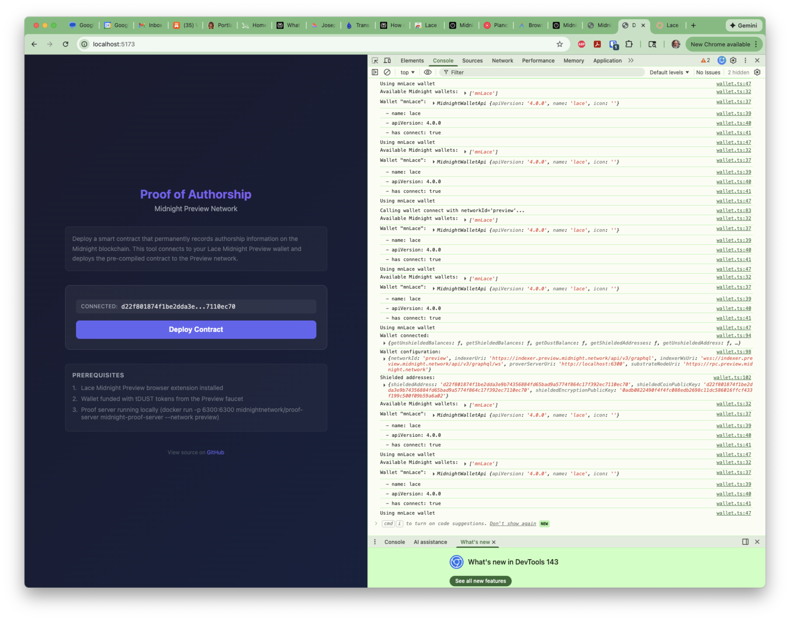

# Midnight Smart Contract POC: A Developer Experience Journal

> **Status**: Deployment not achieved after 8+ hours.
>
> This repository documents one developer's journey attempting to deploy a simple smart contract to the Midnight blockchain. I'm sharing this in the spirit of helpfulness, hoping these observations may be useful to the Midnight team.

*For the complete analysis, see the [Executive Summary](docs/developer-experience-executive-summary.md) (3-min read) or the [Full Developer Experience](docs/my-developer-experience.md).*

## About This Project

I'm a technical writer with deep experience in developer documentation. I gave myself approximately 8 hours to see how far I could get deploying a simple "Proof of Authorship" contract to Midnight's Preview network.

**My goal** was to establish a workflow and document the experience from a newcomer's perspective. I approached this with genuine enthusiasm for the technology and wanted to understand the current developer journey.

**The outcome**: I didn't achieve deployment, but I learned a great deal. The challenges I encountered may reflect gaps in documentation, the rapidly evolving nature of the SDK, or things I simply missed. I'm sharing this experience in case it's helpful.

**Important caveats**:
- This reflects one developer's 8-hour experience, not a comprehensive evaluation
- I may have missed documentation or solutions that would have helped
- The SDK is actively evolving, and some issues may already be addressed
- I don't have insider knowledge of the team's roadmap or priorities

## What I Found Impressive

Before diving into challenges, I want to acknowledge what works well:

- **The Compact language and compiler** worked smoothly - I encountered no obstacles there
- **The ZK technology** is what drew me to Midnight - I'm fascinated by its promise and eager to gain hands-on experience
- **The Discord community** was responsive and genuinely helpful
- **Core infrastructure works** - the indexer, RPC, proof server, and wallet connection all functioned correctly
- **Active development** - the SDK is clearly evolving rapidly

## Current Status

| Component | Status |
|-----------|--------|
| Smart Contract | Compiled (24 lines of Compact) |
| CLI Deployment (`src/deploy.ts`) | Initial attempts blocked by network/SDK issues; rewritten for v3, then pivoted to web |
| Web Deployment (`web-deploy/`) | Wallet connects, deploy blocked by runtime version mismatch |
| **Actual Deployment** | **Not achieved** |

### What Worked

- Contract compilation with Compact toolchain 0.26.0
- Preview network connectivity (indexer, RPC, proof server)
- Lace Midnight Preview wallet connection via DApp Connector API v4
- Wallet funding via Preview faucet

### Where I Got Stuck

**SDK Version Incompatibility**: The Compact toolchain 0.26.0 produces contracts for `compact-runtime` 0.9.0 (CommonJS), but browser deployment requires 0.11.0-rc.1 (ESM). These versions have breaking API changes.

I may have missed a workaround, but I couldn't find a path forward after exploring several options.

## My Journey

### Approach 1: CLI Deployment (Initial)

Started with a Node.js deployment script (`src/deploy.ts`) following the documentation. Challenges I encountered:

1. The getting-started docs pointed to **testnet-02**, which returned 503 errors
2. Discovered (via Discord) that Lace wallet uses the **Preview network**
3. Encountered SDK version mismatches between wallet and contracts libraries

### Approach 2: Web Deployment (Pivot)

Built a browser-based deployment tool (`web-deploy/`) to leverage Lace's built-in network configuration:



*The web app successfully connects to Lace Midnight Preview and retrieves wallet addresses.*

**Progress made:**
- Wallet connection works
- Network configuration retrieved from Lace
- Shielded addresses retrieved

**Where I got stuck:**
```
Error: expected instance of _ChargedState
```

The contract compiled for runtime 0.9.0 couldn't run on runtime 0.11.0-rc.1 due to API changes between versions.

## What I Observed

These are observations from my experience, not definitive assessments:

| Observation | My Experience |
|-------------|---------------|
| Network guidance | I initially targeted testnet-02 before learning Preview is current |
| SDK version coordination | I spent significant time on version mismatches |
| Browser deployment | I couldn't find a working configuration for Vite |
| DApp Connector API | I found v4 differs significantly from documented v3 |

In my experience, most of the 8 hours was spent on SDK and configuration challenges rather than the contract itself. There may be solutions I didn't discover.

## Documentation

Detailed documentation of my entire journey:

- **[Executive Summary](docs/developer-experience-executive-summary.md)** - 3-minute read with key observations
- **[Full Developer Experience](docs/my-developer-experience.md)** - Complete chronological account (1600+ lines)

## Project Structure

```
midnight-smart-contract-poc/
├── contracts/
│   ├── proof-of-authorship.compact   # Smart contract (24 lines)
│   └── managed/                       # Compiled artifacts
├── src/
│   └── deploy.ts                      # CLI deployment script
├── web-deploy/                        # Browser deployment tool
│   ├── src/
│   │   ├── lib/                       # Wallet, providers, deploy logic
│   │   └── components/                # React UI
│   └── vite.config.ts
├── docs/                              # Developer experience documentation
├── img/                               # Screenshots
├── PRD.md                             # Requirements document
└── CLAUDE.md                          # Project rules
```

## The Contract

A simple "Proof of Authorship" contract storing four public fields:

```compact
pragma language_version 0.18;

export ledger authorName: Opaque<"string">;
export ledger timestamp: Opaque<"string">;
export ledger contractHash: Bytes<32>;
export ledger statement: Opaque<"string">;

export circuit recordAuthorship(
  author: Opaque<"string">,
  time: Opaque<"string">,
  hash: Bytes<32>,
  msg: Opaque<"string">
): [] {
  authorName = disclose(author);
  timestamp = disclose(time);
  contractHash = disclose(hash);
  statement = disclose(msg);
}
```

## Quick Start (If You Want to Try)

### Prerequisites

- Node.js 20+
- Docker Desktop
- Compact compiler (toolchain 0.26.0)
- Lace Midnight Preview browser extension

### CLI Approach

```bash
# Install dependencies
npm install

# Compile contract
npm run compile

# Start proof server (Preview network)
docker run -p 6300:6300 midnightnetwork/proof-server midnight-proof-server --network preview

# Build and deploy
npm run build
npm run deploy
```

### Web Approach

```bash
cd web-deploy
npm install
npm run dev
# Open http://localhost:5173 in Chrome with Lace Midnight Preview
```

## Network Configuration

| Service | Endpoint |
|---------|----------|
| Indexer | https://indexer.preview.midnight.network/api/v3/graphql |
| RPC Node | https://rpc.preview.midnight.network |
| Proof Server | http://localhost:6300 (with `--network preview`) |
| Faucet | https://faucet.preview.midnight.network/ |

**Note**: I found that Lace Midnight Preview uses the Preview network, which differs from testnet-02 referenced in some documentation.

## Observations That May Be Helpful

Based on my experience, these are areas where I encountered friction. The team may already be aware of these or have solutions I didn't find:

1. **Network clarity** - I initially followed docs to testnet-02 before learning Preview is current
2. **Version coordination** - A compatibility matrix (toolchain → runtime → network) would have helped me
3. **Browser deployment** - I couldn't find guidance for Vite/Webpack bundler configuration
4. **Module format** - The CommonJS runtime didn't work with modern bundlers in my testing
5. **DApp Connector API** - I found v4 significantly different from v3; migration notes would have helped

I offer these observations humbly - there may be documentation or solutions I missed, and the team surely has context I lack.

## Author

Joseph Fajen - January 2026

---

*I'm sharing this project in the spirit of friendly collaboration. As someone who works in developer documentation, I know how challenging it is to keep docs current with rapidly evolving software. I hope these observations from a newcomer's perspective might be useful.*
