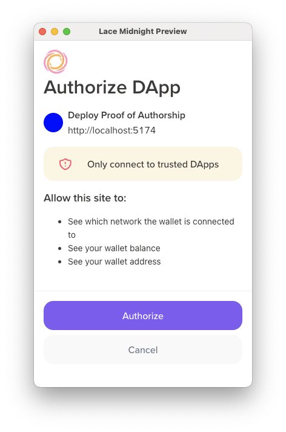
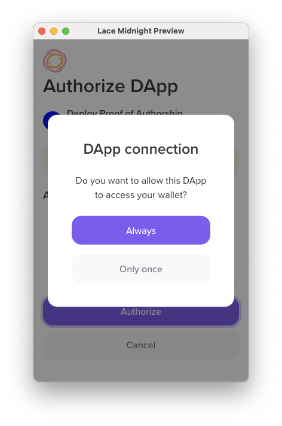
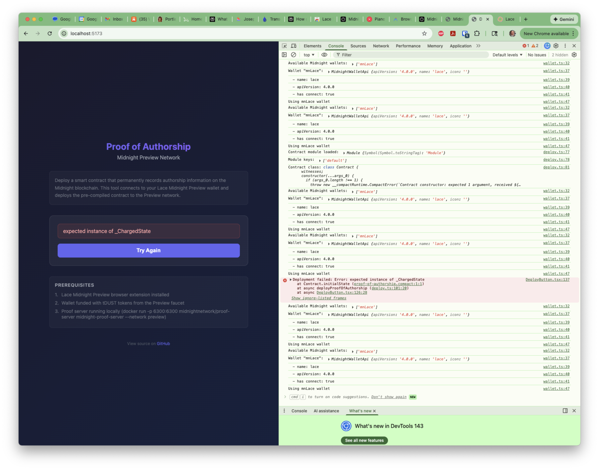

# My Developer Experience: Midnight Smart Contract POC

A chronological account of attempting to deploy a proof-of-authorship smart contract on the Midnight blockchain.

*For a 3-minute overview, see the [Executive Summary](./developer-experience-executive-summary.md).*

---

## Preface

This document is a detailed journal of my experience as a developer new to Midnight. I'm sharing it in the spirit of helpfulness, with some important context:

- **This is one person's experience** - not a comprehensive evaluation of Midnight
- **I may have missed things** - there may be documentation or solutions I didn't find
- **The SDK is actively evolving** - some challenges may already be addressed
- **I lack insider context** - the team has priorities and knowledge I'm not aware of

I approached this project with genuine enthusiasm for Midnight's technology. The Compact language and compiler worked smoothly for me, the ZK technology is what drew me to this project, and the Discord community was genuinely helpful. I'm documenting both successes and challenges because I believe honest feedback, offered constructively, can be useful.

As someone who works in developer documentation, I understand how difficult it is to keep docs current with rapidly evolving software. I offer these observations as a friendly data point from a newcomer's perspective.

---

## Executive Summary

### The Goal

Deploy the simplest possible smart contract to Midnight's testnet: a "Proof of Authorship" contract that stores four public fields (author name, timestamp, contract hash, and a statement). No complex ZK logic, no private data, no token transfers. Just write, compile, deploy, done.

**My expectation**: A few hours, maybe a day.

**Actual time invested**: 8+ hours. **Deployment not achieved.**

### Current Status (2026-01-25)

| Component | Status |
|-----------|--------|
| Smart Contract | ✅ Written and compiled (24 lines) |
| CLI Deployment Script | ⚠️ Builds but has type mismatches |
| Web Deployment Tool | ⚠️ Wallet connects, deploy blocked |
| Actual Deployment | ❌ **Not achieved** |

Two parallel deployment approaches were built, both blocked by SDK issues:

1. **CLI approach** (`src/deploy.ts`): Node.js script with type assertions to bridge SDK version mismatches. WebSocket connection timeouts and address prefix issues.

2. **Web approach** (`web-deploy/`): Browser app using Lace wallet. Wallet connection works, but blocked by compact-runtime version incompatibility - the compiled contract expects runtime 0.9.0 (CommonJS, fails in Vite) but we need 0.11.0-rc.1 (ESM, works in Vite but has breaking API changes).

**Deployment was never achieved despite 8+ hours of effort.**

### Challenges I Encountered

In my experience, the core challenge wasn't the contract or the code—it was navigating network transitions and SDK version coordination:

1. **Documentation points to testnet-02**, which has availability issues (503 errors on indexer)
2. **Lace Midnight Preview wallet uses "Preview" network**, which is different from testnet-02
3. **Preview network requires completely different SDK packages** (v3.0.0-alpha vs v2.x)
4. **The migration guide exists but isn't linked from getting-started docs**
5. **SDK type incompatibilities** between wallet and contracts libraries required workarounds
6. **Browser deployment blocked by version matrix**: Compact toolchain 0.26.0 produces contracts for runtime 0.9.0 (CommonJS), but Vite requires ESM. Runtime 0.11.0-rc.1 is ESM but has breaking API changes incompatible with 0.26.0 contracts.
7. **No upgrade path available**: No newer Compact compiler exists that produces contracts for the 0.11.0 runtime.

The contract itself took 30 minutes. The SDK/network/bundler debugging took 8+ hours.

### Areas Where I Encountered Friction

Midnight is a ZK blockchain with technology I find exciting and want to explore further. These are areas where I spent significant time (there may be solutions I didn't find):

| Observation | My Experience |
|-------------|---------------|
| Network guidance | I initially targeted testnet-02 before learning Preview is current |
| SDK version discovery | I found the migration guide late in my process |
| Lace + CLI integration | I built a web app as an alternative approach |
| Address prefix differences | Required debugging to understand |
| SDK version coordination | The v2.x packages didn't work with Lace in my testing |
| Browser deployment | I couldn't find guidance for Vite/Webpack |
| Toolchain ↔ runtime coordination | I spent significant time on version mismatches |
| Module format | The CommonJS runtime didn't work with modern bundlers in my testing |

**A developer following the main documentation today will:**
1. End up with incompatible SDK packages for the recommended wallet
2. Be unable to deploy via browser due to runtime version incompatibilities
3. Spend 8+ hours debugging issues that documentation would prevent

### What Would Have Helped

1. A prominent "Which network should I use?" section pointing to Preview
2. Getting-started docs using v3.0.0-alpha packages (not v2.x)
3. Clear warning that testnet-02 is deprecated/unstable
4. Lace wallet integration guide for CLI developers
5. SDK version compatibility matrix
6. **Compact toolchain ↔ runtime version matrix** (which compiler produces contracts for which runtime)
7. **Browser deployment guide** covering Vite/Webpack bundler configuration
8. **ESM-only SDK packages** or documented workarounds for CommonJS/WASM issues
9. DApp Connector API v4 migration guide (v4 is significantly different from v3)

### Top 3 Questions for Midnight "Ask AI" Chatbot

Based on everything I learned, these questions would surface the most critical missing documentation:

**Question 1: "Which version of compact-runtime is compatible with contracts compiled by Compact toolchain 0.26.0?"**

*Why this matters:* The toolchain produces contracts expecting runtime 0.9.0, but we needed 0.11.0-rc.1 for browser deployment. A version compatibility matrix would have saved 4+ hours of debugging.

**Question 2: "How do I deploy a Midnight smart contract from a browser using Vite? The compact-runtime package has CommonJS/WASM loading issues with esbuild."**

*Why this matters:* This specific technical issue blocked browser deployment in my experience. Either (a) there's a workaround I didn't find, (b) there's a browser-compatible package I didn't know about, or (c) this is a known limitation.

**Question 3: "I'm a new developer starting today. Should I use testnet-02 or Preview network, and which SDK package versions do I need?"**

*Why this matters:* The getting-started docs point to testnet-02 with v2.x SDK, but the recommended Lace wallet uses Preview with v3.0.0-alpha SDK. A clear answer here would prevent the entire network/SDK mismatch journey.

---

### What's Next

1. ~~Run actual deployment test (CLI or web approach)~~ Blocked
2. ~~Fund wallet via Preview faucet~~ ✅ Completed
3. ~~Deploy contract and verify on indexer~~ Not reached
4. **Share this documentation with Midnight team** (in case it's helpful)
5. Revisit when I learn more or SDK evolves

---

## Objective

Deploy a simple "Proof of Authorship" smart contract to Midnight's testnet as an artifact demonstrating:
- Writing smart contracts in Compact (Midnight's DSL)
- Using the Midnight SDK for TypeScript-based deployment
- Working with ZK proof generation
- Navigating real-world blockchain development challenges

---

## Timeline

### 2026-01-23: Initial Implementation

Completed the core implementation:
- Wrote `proof-of-authorship.compact` - a simple contract storing author name, timestamp, contract hash, and a statement
- Created `deploy.ts` - TypeScript deployment script handling wallet setup, funding, and contract deployment
- Successfully compiled the contract using `compact compile`
- Built the TypeScript with no errors

### 2026-01-24: Deployment Attempt and Troubleshooting

#### First Deployment Attempt

Started the proof server via Docker and ran `npm run deploy`. The script successfully:
- Loaded the compiled contract
- Built the wallet from a seed
- Started syncing with the network

However, the wallet sync repeatedly showed:
```
[] | Timed out trying to connect
```

#### Systematic Investigation

Rather than assuming the issue, I conducted a methodical investigation.

**Step 1: Verify Testnet Endpoints**

Consulted the Midnight docs AI chatbot to confirm the correct endpoints:
- Indexer: `https://indexer.testnet-02.midnight.network/api/v1/graphql`
- Indexer WS: `wss://indexer.testnet-02.midnight.network/api/v1/graphql/ws`
- RPC Node: `https://rpc.testnet-02.midnight.network`

Result: My endpoints matched the documentation exactly. No testnet-03 or path changes.

**Step 2: Check Authentication Requirements**

Asked the chatbot about API keys or required headers.

Result: No special authentication needed for basic access. Only requirements:
- `Content-Type: application/json` for HTTP
- `Sec-WebSocket-Protocol: graphql-transport-ws` for WebSocket

**Step 3: Test Individual Endpoints**

Tested each endpoint independently:

```bash
# RPC Node - SUCCESS
curl -X POST "https://rpc.testnet-02.midnight.network" \
  -H "Content-Type: application/json" \
  -d '{"jsonrpc":"2.0","method":"chain_getBlockHash","params":[0],"id":1}'
# Returns: {"jsonrpc":"2.0","id":1,"result":"0x2757396f..."}

# Indexer - FAILED
curl "https://indexer.testnet-02.midnight.network/api/v1/graphql" \
  -H "Content-Type: application/json" \
  -d '{"query":"{ __typename }"}'
# Returns: 503 Service Temporarily Unavailable (nginx)
```

Key finding: The blockchain (RPC node) was running fine, but the indexer service was unavailable.

**Step 4: Verify SDK Versions**

Asked the chatbot about recommended SDK versions. Found a discrepancy:
- My `compact-runtime`: 0.9.0
- Documented version: ^0.8.1

Fixed by updating `package.json` and running `npm install`. Note: This version mismatch wouldn't cause a server-side 503, but aligning with documented versions is best practice.

**Step 5: Community Outreach**

Posted on Midnight Discord with specific technical details:
- Described the 503 error on indexer endpoints
- Noted that RPC node works fine
- Asked if others could reach the indexer

Response from community member confirmed: "Since your RPC node is healthy but both the HTTP + WebSocket indexer endpoints are returning nginx 503, this strongly points to an indexer-side service outage or overload, not an issue in your code."

Additional insight: "If the indexer falls behind chain head, some providers take it offline until it resyncs."

**Step 6: Team Engagement**

A community/team member reached out directly: "Kindly send a PM let me check with the team." This led to direct communication with someone who could escalate the infrastructure issue internally.

**Step 7: Server-Side Confirmation**

The team member suggested potential causes for 503 errors (too many WS connections, aggressive polling, User-Agent header issues) and provided a diagnostic test:

```bash
curl -I https://indexer.testnet-02.midnight.network/health
curl -I https://indexer.testnet-02.midnight.network/
```

Both returned HTTP 503, confirming this was a server-side issue rather than rate-limiting on my end.

**Step 8: Network Discovery - Preview vs Testnet-02**

The team member asked if I was using a Lace wallet. This led to installing **Lace Midnight Preview** (a separate Chrome extension from the regular Cardano Lace wallet).

During Lace Midnight Preview setup, I discovered a critical distinction: the wallet connects to the **Preview** network, not **testnet-02**. When I asked Discord about this, they confirmed: "Preview in the Lace wallet is not the same as testnet-02; they are different networks."

The Lace configuration screen revealed the Preview network endpoints:

| Service | Preview Endpoint |
|---------|------------------|
| RPC Node | `https://rpc.preview.midnight.network` |
| Indexer | `https://indexer.preview.midnight.network/api/v3/graphql` |

Testing confirmed the Preview endpoints work:

```bash
# Preview Indexer - SUCCESS
curl "https://indexer.preview.midnight.network/api/v3/graphql" \
  -H "Content-Type: application/json" \
  -d '{"query":"{ __typename }"}'
# Returns: {"data":{"__typename":"Query"}} (HTTP 200)

# Preview RPC - SUCCESS
curl -X POST "https://rpc.preview.midnight.network" \
  -H "Content-Type: application/json" \
  -d '{"jsonrpc":"2.0","method":"chain_getBlockHash","params":[0],"id":1}'
# Returns: {"jsonrpc":"2.0","id":1,"result":"0x3acf6189..."}
```

This was a breakthrough: the documentation I followed pointed to testnet-02, but the recommended path (using Lace Midnight Preview) requires the Preview network.

---

### 2026-01-24: Deep Dive into Wallet/Seed Integration

After updating the deploy script to use Preview network endpoints, the next challenge was integrating with the Lace Midnight Preview wallet.

#### The Mnemonic vs Hex Seed Problem

**Initial Discovery**

The Midnight SDK's `WalletBuilder.build()` expects a hex-encoded seed:
```typescript
WalletBuilder.build(indexer, indexerWS, proofServer, node, seedHex, networkId, logLevel)
```

But Lace Midnight Preview uses a 24-word BIP-39 mnemonic. The Discord contact suggested exporting the Lace wallet's seed for CLI deployment, implying there should be a way to derive the same wallet.

**Research: How Does Midnight Expect Seeds?**

Installed `@midnight-ntwrk/wallet-sdk-hd` package (version 2.0.0) which provides HD wallet support. Key findings:

1. The SDK expects a 32-byte (64-character hex) seed
2. The `generateRandomSeed()` function produces 32 random bytes
3. There's no built-in `mnemonicToSeed` function exported

The SDK internally uses `@scure/bip39` for mnemonic validation.

#### Derivation Method Experiments

Created `src/verify-mnemonic.ts` to test different seed derivation approaches:

**Method 1: Raw Entropy**

BIP-39 24-word mnemonic = 256 bits of entropy = 32 bytes

```typescript
import { mnemonicToEntropy } from "@scure/bip39";
const entropy = mnemonicToEntropy(mnemonic, wordlist);
// Use as seed directly
```

Result: SDK accepted it (32 bytes), but address didn't match Lace.

**Method 2: Icarus/CIP-3 Derivation**

Cardano/Midnight uses Icarus-style key derivation (SLIP-0023):

```typescript
function deriveIcarusMasterKey(entropy: Uint8Array): Uint8Array {
  // PBKDF2-HMAC-SHA512 with 4096 iterations
  const derived = crypto.pbkdf2Sync(
    Buffer.from(""),           // empty password
    Buffer.from(entropy),       // entropy as salt
    4096,                       // iterations
    96,                         // 96 bytes output
    "sha512"
  );
  // Apply Ed25519 bit tweaking
  derived[0] &= 0xf8;
  derived[31] = (derived[31] & 0x1f) | 0x40;
  return derived.subarray(0, 32);  // first 32 bytes
}
```

Result: Different address, still didn't match Lace.

**Method 3: BIP-39 Standard Seed (first 32 bytes)**

Standard BIP-39 produces 64 bytes via PBKDF2:

```typescript
import { mnemonicToSeedSync } from "@scure/bip39";
const seed = mnemonicToSeedSync(mnemonic, "");  // 64 bytes
const first32 = seed.subarray(0, 32);
```

Result: Different address, still didn't match Lace.

**Method 4: BIP-39 Standard Seed (last 32 bytes)**

```typescript
const last32 = seed.subarray(32, 64);
```

Result: Different address, still didn't match Lace.

#### The Network ID Mismatch Discovery

After testing all 4 derivation methods, a pattern emerged:

| Derived Addresses | Lace Addresses |
|-------------------|----------------|
| `mn_shield-addr_test1...` | `mn_shield-addr_preview1...` |
| `mn_shield-addr_test1...` | `mn_addr_preview1...` |

**Key Finding**: All SDK-derived addresses have `_test1` prefix, but Lace shows `_preview1` prefix.

The SDK's `NetworkId` enum only has:
- `Undeployed`
- `DevNet`
- `TestNet`
- `MainNet`

There is no `Preview` option. Using `NetworkId.TestNet` produces `test1` addresses, not `preview1`.

This suggests a fundamental mismatch between:
1. What the SDK thinks "TestNet" means (`test1` prefix)
2. What the Preview network actually uses (`preview1` prefix)

#### Current Blockers

1. **Network ID Configuration**: The SDK doesn't have a `Preview` network ID that produces `preview1` addresses
2. **Unknown Derivation**: Even if we solve the network ID, we haven't found the correct seed derivation that matches Lace

#### Tools Created

- `src/verify-mnemonic.ts` - Tests multiple derivation methods and compares addresses
- `npm run verify-mnemonic` - Script to run the verification tool

---

### 2026-01-24: Discord Clarification on Bech32 Prefixes

Asked Amy.ether on Discord about the `_test1` vs `_preview1` address prefix mismatch. Her response clarified a key misconception:

> "Preview is not a different NetworkId — it's still Testnet (0). But Lace's Preview network uses a different bech32 address prefix and genesis config than 'legacy testnet', and most SDKs default to the old testnet environment, not Preview."

**Key Insight**: The issue is NOT about `NetworkId` at all. Both testnet-02 and Preview use `NetworkId.TestNet` (value 0). The difference is:

1. **Bech32 address prefix** - Preview uses `_preview1`, legacy testnet uses `_test1`
2. **Genesis configuration** - Different chain genesis between the networks

The SDK defaults to legacy testnet bech32 encoding, which produces `addr_test1...` style addresses, while Lace's Preview network expects `addr_preview1...` prefixes.

Amy indicated she would provide specific configuration details for using Preview's bech32 scheme with the SDK. Awaiting that information.

---

### 2026-01-24: Testing Cardano Address Derivation

Amy.ether provided a suggestion to use the `cardano-address` CLI tool to derive keys from the Lace mnemonic:

```bash
echo "word1 word2 word3 ... word24" | cardano-address key from-recovery-phrase Shelley > root.prv
```

With derivation paths:
- `m/1852'/1815'/0'/0/0` (payment)
- `m/1852'/1815'/0'/2/0` (stake)

#### Setup

Downloaded and installed `cardano-address` v4.0.2 from the official IntersectMBO/cardano-addresses repository (the official Cardano Foundation tool). Created a local script (`scripts/test-cardano-derivation.sh`) to safely test derivation without exposing the mnemonic.

#### Results

The derivation worked correctly, producing valid Cardano addresses:

**Derived from mnemonic (standard Cardano path):**
```
Testnet Payment: addr_test1vqkq...gddsz0xclz
Testnet Stake:   stake_test1uzpf...3us3u2mry
```

**Lace Midnight Preview addresses:**
```
Unshielded: mn_addr_preview1zw8...t8qhw2js7
Shielded:   mn_shield-addr_preview16ghc...fkkdx5qsx0xvs7
```

#### Analysis

**The addresses don't match - and it's not just a prefix difference.**

The Bech32-encoded data portions are entirely different, meaning the underlying public keys are different. This rules out the theory that it's just a bech32 prefix configuration issue.

**Key findings:**

1. **Standard Cardano derivation doesn't produce Midnight keys** - The path `m/1852'/1815'/0'/0/0` (CIP-1852 standard) produces Cardano keys, not Midnight keys.

2. **Different key material entirely** - If it were just a prefix issue, the data after the prefix would be similar. It's not.

3. **Midnight likely uses a different derivation scheme** - Possibilities include:
   - Different HD derivation path (different coin type, not `1815'`)
   - Additional key transformation on top of Cardano keys
   - Entirely separate key generation from the same mnemonic entropy

#### Tools Created

- `/tmp/cardano-address` - Official Cardano address CLI (v4.0.2)
- `scripts/test-cardano-derivation.sh` - Safe local script to test mnemonic derivation

#### Next Step

Follow up with Amy.ether to clarify:
> "The cardano-address derivation produces valid Cardano testnet addresses, but they don't match my Lace Midnight addresses. The key material is completely different, not just the prefix. Does Midnight use a different HD derivation path than standard Cardano?"

---

### 2026-01-24: Midnight Docs AI Breakthrough + Testing HD Derivation

#### Discovery from Midnight Docs "Ask AI"

Asked the Midnight docs chatbot: "How do I derive a wallet seed from my Lace Midnight Preview wallet's 24-word mnemonic for use with WalletBuilder in the TypeScript SDK?"

The response was highly informative:

1. **Midnight's HD derivation path is documented**: `m/44'/2400'/account'/role/index`
   - `2400'` is Midnight's coin type (different from Cardano's `1815'`)
   - Uses `Roles.Zswap` (role 3) for wallet seed derivation

2. **The SDK package**: `@midnight-ntwrk/wallet-sdk-hd` handles HD derivation

3. **The documented flow**:
   ```
   Mnemonic → BIP-39 seed (64 bytes) → HDWallet.fromSeed() → selectAccount(0) → selectRole(Roles.Zswap) → deriveKeyAt(0) → wallet seed
   ```

4. **What's NOT documented**: How to convert mnemonic to the binary seed (the docs say "use a BIP-39 implementation yourself")

This was a significant find - we now knew Midnight uses coin type `2400'`, not Cardano's `1815'`.

#### Updated Verification Script

Added Method 5 to `src/verify-mnemonic.ts` implementing the documented Midnight HD derivation:

```typescript
function deriveMidnightWalletSeed(bip39Seed: Uint8Array): string | null {
  const generatedWallet = HDWallet.fromSeed(bip39Seed);
  if (generatedWallet.type !== "seedOk") return null;

  const zswapKey = generatedWallet.hdWallet
    .selectAccount(0)
    .selectRole(Roles.Zswap)
    .deriveKeyAt(0);

  if (zswapKey.type === "keyDerived") {
    return Buffer.from(zswapKey.key).toString("hex");
  }
  return null;
}
```

#### Test Results

Ran all 5 derivation methods with the Lace mnemonic:

| Method | Derived Address Prefix | Match? |
|--------|----------------------|--------|
| 1. Raw Entropy | `mn_shield-addr_test1...` | No |
| 2. Icarus/CIP-3 | `mn_shield-addr_test1...` | No |
| 3. BIP-39 first 32 bytes | `mn_shield-addr_test1...` | No |
| 4. BIP-39 last 32 bytes | `mn_shield-addr_test1...` | No |
| 5. Midnight HD (m/44'/2400'/0'/3/0) | `mn_shield-addr_test1...` | No |

**Lace shows**: `mn_shield-addr_preview1...`

**Key observations:**
1. **All methods produce `_test1` prefix**, but Lace shows `_preview1`
2. **The key material itself is different** - even accounting for prefix, the addresses don't match
3. **Even the documented Midnight HD path doesn't match Lace**

#### Remaining Unknowns

1. **BIP-39 passphrase** - I used empty string `""`. Does Lace use a passphrase?
2. **Network config affects key derivation** - The `_test1` vs `_preview1` might indicate the SDK derives keys differently per network, not just encodes addresses differently
3. **Different derivation indices** - Lace might use different account, role, or key index values

#### Amy's Continued Recommendation

Amy.ether continues to recommend using `multiappfix.pages.dev` with wallet connect. When asked for clarification about the derivation mismatch, she pointed back to this tool rather than providing SDK configuration details.

**Questions sent to Amy:**
1. Does Lace use a BIP-39 passphrase when deriving the seed?
2. Does Preview network require different SDK configuration that affects key derivation?
3. What specifically does multiappfix.pages.dev do? Is it an official Midnight tool?

---

### 2026-01-24: Root Cause Found - Wrong SDK Version

#### The Breakthrough Question

Asked the Midnight docs AI: "How do I configure the Midnight SDK to produce addresses with `preview1` prefix for the Preview network? Using `setNetworkId(NetworkId.TestNet)` produces `_test1` prefix addresses, but Lace Midnight Preview shows `_preview1` addresses."

**Response**: The docs AI confirmed that `preview1` HRP is **not documented** in the current SDK docs. It pointed to a migration guide showing that Preview network uses a completely different SDK configuration with **string literal** `networkId: 'preview'` instead of the enum-based `NetworkId.TestNet`.

#### Migration Guide Discovery

Fetched the migration guide at `https://docs.midnight.network/how-to/migrate-from-testnet-02-to-preview` and discovered we're using **entirely the wrong SDK version**.

**Our current setup (testnet-02 era):**
```json
{
  "@midnight-ntwrk/compact-runtime": "^0.8.1",
  "@midnight-ntwrk/ledger": "^4.0.0",
  "@midnight-ntwrk/midnight-js-contracts": "2.0.2",
  "@midnight-ntwrk/midnight-js-network-id": "2.0.2",
  "@midnight-ntwrk/wallet": "5.0.0",
  "@midnight-ntwrk/wallet-sdk-hd": "^2.0.0"
}
```

**Preview network requires (v3.0.0-alpha):**
```json
{
  "@midnight-ntwrk/compact-runtime": "0.11.0-rc.1",
  "@midnight-ntwrk/ledger-v6": "6.1.0-alpha.6",
  "@midnight-ntwrk/midnight-js-contracts": "3.0.0-alpha.11",
  "@midnight-ntwrk/midnight-js-network-id": "3.0.0-alpha.11",
  "@midnight-ntwrk/wallet-sdk-facade": "1.0.0-beta.12",
  "@midnight-ntwrk/wallet-sdk-hd": "3.0.0-beta.7"
}
```

**Additional requirements for Preview:**
- Node.js 22.x (we may have 20.x)
- Compact compiler 0.27.0 (we have 0.2.0)
- Proof server with `--network preview` flag

#### What This Explains

| Issue | Root Cause |
|-------|------------|
| `_test1` prefix instead of `_preview1` | Old SDK only knows old network IDs |
| Address mismatch with Lace | Old wallet SDK uses different derivation/encoding |
| Lace incompatibility | Lace uses Preview SDK, we're on testnet-02 SDK |
| None of 5 derivation methods worked | Entire SDK architecture is different |

#### The Real Problem

I followed documentation that was written for testnet-02, but:
1. testnet-02 indexer is down (503 errors)
2. Lace Midnight Preview uses the Preview network
3. Preview network requires completely different SDK packages
4. The migration guide exists but wasn't prominently linked from getting-started docs

#### Options Forward

1. **Full SDK upgrade to v3.0.0-alpha** - Significant rewrite:
   - Update all package versions
   - Update Compact compiler to 0.27.0
   - Rewrite deploy.ts for new API (different providers, async patterns)
   - Recompile contract with new compiler
   - Test with Preview network

2. **Fallback: Fresh wallet with current SDK** - Deploy to whatever network v2 SDK supports:
   - Generate new seed (don't try to match Lace)
   - May need to find a working testnet-02 alternative
   - Achieves deployment goal without Lace integration

3. **Wait for stable v3 SDK** - The packages are all alpha/beta, may have breaking changes

---

## Documentation Observations

Throughout this journey, I encountered areas where I wished I had more guidance. These are observations from my experience - there may be documentation I missed, and I recognize the team has context I lack.

### What the Docs Cover Well

- Compact language syntax and semantics
- SDK package installation and basic usage
- Deployment flow structure
- testnet-02 endpoint configuration

### Areas Where I Needed More Guidance

1. **Network selection**
   - I found that docs reference testnet-02, but Lace Midnight Preview connects to a different "Preview" network
   - This distinction wasn't clear to me initially
   - Following the docs led me to testnet-02 before I learned about the Preview network

2. **No clear path for Lace wallet + CLI integration**
   - The SDK expects 32-byte hex seeds
   - Lace uses 24-word BIP-39 mnemonics
   - No documentation on how to derive one from the other
   - No guidance on using a Lace-created wallet programmatically

3. **Bech32 prefix configuration undocumented**
   - The `_test1` vs `_preview1` prefix difference is never mentioned
   - A developer wouldn't know they need different bech32 settings for Preview
   - This caused significant confusion and debugging time

4. **Which network should developers use?**
   - If Lace Midnight Preview is the recommended wallet, docs should lead with Preview endpoints
   - Instead, docs point to testnet-02 which appears to have availability issues
   - No clear recommendation on "start here" network

5. **Seed derivation specifics missing**
   - No documentation on how Midnight/Cardano derives keys from mnemonics
   - Multiple derivation standards exist (Icarus, BIP-39, etc.)
   - Had to experiment with 4+ methods without guidance

6. **SDK `NetworkId` enum doesn't match reality**
   - Enum has: Undeployed, DevNet, TestNet, MainNet
   - No Preview option, even though Preview is a distinct network with different address encoding
   - Misleading because Preview technically uses `NetworkId.TestNet` but with different bech32 config

7. **Migration guide not linked from getting-started**
   - Critical migration guide exists at `/how-to/migrate-from-testnet-02-to-preview`
   - Contains essential version requirements for Preview network
   - Not linked from the main tutorials or getting-started pages
   - A developer following the main docs ends up with incompatible v2.x SDK

8. **SDK version requirements buried**
   - Preview requires v3.0.0-alpha SDK packages, but this isn't stated upfront
   - The "stable" v2.x packages in npm appear current but only work with deprecated testnet-02
   - No clear "which versions for which network" compatibility matrix

### Impact on Developer Experience

- Required Discord support to understand basic network topology
- Multiple hours spent debugging issues that clear documentation would prevent
- Had to build custom diagnostic tools (`verify-mnemonic.ts`) to understand the system
- Still blocked on deployment pending undocumented configuration details

### Potential Documentation Improvements

1. Add a "Network Overview" page explaining testnet-02 vs Preview vs future networks
2. Document Lace wallet integration for CLI developers
3. Explain bech32 prefix configuration and when different prefixes are needed
4. Provide example code for mnemonic-to-seed derivation
5. Clearly state which network new developers should target

### Diagnostic Questions for Docs AI Chatbot

To test whether the official documentation covers these gaps, we formulated targeted questions for the Midnight docs "Ask AI" chatbot. These questions are designed to probe specific knowledge gaps:

**Primary questions (most likely to surface useful info):**

1. "How do I configure bech32 address prefix in the Midnight SDK?"
   - *Directly asks about the configuration mechanism needed for Preview*

2. "How do I configure the SDK to work with Preview network instead of testnet?"
   - *May surface any Preview-specific setup documentation*

3. "What is the difference between Preview network and testnet-02 endpoints?"
   - *Tests whether the network distinction is documented anywhere*

**Secondary questions:**

4. "How do I derive a wallet seed from a 24-word mnemonic for use with WalletBuilder?"
   - *Direct question about the mnemonic-to-seed derivation path*

5. "How do I use my Lace Midnight wallet with the TypeScript SDK for CLI deployment?"
   - *Tests if there's any Lace + CLI integration documentation*

6. "What genesis configuration does Preview network use?"
   - *Amy mentioned genesis config differs - might surface technical details*

**Specific symptom-based question:**

7. "How do I change the address prefix from test1 to preview1?"
   - *Very specific to our exact observed symptom*

If these questions return empty or generic answers, it confirms the documentation gaps identified above. If they return useful configuration details, we have our solution.

**Results:** *(To be filled in after testing)*

---

## Findings

### What Works (After SDK Upgrade)
- Contract compilation with Compact toolchain 0.26.0
- TypeScript deployment script builds successfully
- Proof server (Docker) on localhost:6300 with `--network preview`
- Preview network connectivity (indexer and RPC respond)
- Wallet creation with SDK-generated seeds
- v3.0.0-alpha SDK configured for Preview network
- Network ID set to `"preview"` string for middleware

### Resolved Blockers

1. ~~**Network ID Mismatch**~~: Resolved by upgrading to v3.0.0-alpha SDK and using `setNetworkId("preview")` string configuration.

2. **Seed Derivation (Lace Integration)**: Deferred - using fresh CLI-generated wallet instead of Lace mnemonic.

### Remaining Unknowns

1. **Runtime compatibility** - Type assertions used to bridge wallet SDK v5 with contracts v3-alpha; runtime behavior untested.

2. **Address prefix verification** - Need to confirm wallet produces `_preview1` addresses after deployment test.

### SDK Version Alignment

Current dependencies (upgraded for Preview network):

| Package | Version | Notes |
|---------|---------|-------|
| @midnight-ntwrk/wallet | 5.0.0 | Kept from v2 |
| @midnight-ntwrk/wallet-api | 5.0.0 | Kept from v2 |
| @midnight-ntwrk/wallet-sdk-hd | 3.0.0-beta.7 | Upgraded |
| @midnight-ntwrk/wallet-sdk-facade | 1.0.0-beta.12 | New |
| @midnight-ntwrk/midnight-js-* | 3.0.0-alpha.11 | Upgraded |
| @midnight-ntwrk/compact-runtime | 0.11.0-rc.1 | Upgraded |
| @midnight-ntwrk/ledger-v6 | 6.1.0-alpha.6 | New (replaced ledger) |
| @midnight-ntwrk/zswap | 4.0.0 | Re-added |

---

## Lessons Learned

### From Initial Troubleshooting (Session 1)

1. **Test endpoints independently** - When deployment fails, isolate which service is actually down. The RPC node and indexer are separate services.

2. **Consult official docs carefully** - The Midnight docs AI chatbot was helpful for verifying endpoints and SDK versions.

3. **Version alignment matters** - Even if newer versions exist, stick with the documented compatibility matrix for testnet.

4. **Community is a resource** - Discord provided quick confirmation that the issue was infrastructure-side, saving further debugging time. A team member also proactively reached out to escalate the issue internally.

5. **The indexer is critical** - Unlike some blockchains where you can interact directly with nodes, Midnight's wallet SDK requires the indexer for synchronization.

6. **Multiple networks exist** - Midnight has multiple networks (testnet-02, Preview, etc.). The Lace Midnight Preview wallet specifically uses the Preview network.

7. **Lace Midnight Preview is separate** - The Midnight-enabled Lace wallet is a separate Chrome extension from the regular Cardano Lace wallet.

### From Wallet Integration (Session 2)

8. **Seed format matters** - The SDK expects 32-byte hex seeds, not 24-word mnemonics or 64-byte BIP-39 seeds.

9. **Cardano heritage affects Midnight** - Midnight inherits from Cardano, which uses Icarus-style key derivation (PBKDF2 with 4096 iterations) rather than standard BIP-39 PBKDF2 (2048 iterations).

10. **Network IDs affect address encoding** - Midnight addresses include network identifiers in their Bech32m encoding (`test1`, `preview1`, etc.). The SDK's network configuration must match the target network.

11. **Address format is revealing** - The address prefix (e.g., `mn_shield-addr_preview1`) encodes: network type (preview), address type (shielded), and is useful for debugging integration issues.

12. **Build verification tools** - Creating `verify-mnemonic.ts` to test derivation methods systematically was more efficient than trial-and-error in the deployment script.

13. **Document negative results** - Recording what DIDN'T work (4 derivation methods) is as valuable as what did work.

14. **Midnight keys ≠ Cardano keys** - Despite Midnight's Cardano heritage, standard Cardano HD derivation (CIP-1852, path m/1852'/1815'/0'/0/0) does not produce Midnight-compatible keys. The same mnemonic produces entirely different public keys for Cardano vs Midnight.

15. **Test with official tools first** - Using the official `cardano-address` CLI let us definitively rule out the "just a prefix difference" theory. The key material itself is different.

16. **Documentation can be incomplete** - Even with the correct HD path from official docs (m/44'/2400'/0'/3/0), the derived addresses still didn't match Lace. The docs show the derivation code but don't cover all the variables (passphrase, network-specific config).

17. **Ask the docs AI chatbot** - The Midnight docs "Ask AI" feature provided the HD path information that wasn't easily discoverable in the static docs. It also honestly stated what ISN'T documented.

18. **Check for migration guides early** - The testnet-02 → Preview migration guide existed but wasn't prominently linked. It contained critical information about SDK version requirements that would have saved hours of debugging.

19. **Version mismatches can cause subtle failures** - The old SDK "worked" (compiled, ran, connected) but produced incompatible addresses. This is worse than a hard failure because it appears to work until you try to integrate with other tools.

20. **Alpha/beta doesn't mean optional** - Preview network *requires* v3.0.0-alpha SDK packages. The "stable" v2.x packages only work with the deprecated testnet-02.

---

## Resolution

*In Progress* - Wallet integration with Lace Midnight Preview remains unsolved, but we now understand the root cause.

### Root Cause (Confirmed)

The issue is **bech32 address prefix configuration**, not `NetworkId`:

- Preview and testnet-02 both use `NetworkId.TestNet` (value 0)
- The difference is the bech32 human-readable prefix used in address encoding
- SDK defaults to legacy testnet prefix (`_test1`)
- Preview network uses a different prefix (`_preview1`)

### What I'm Waiting For

Amy.ether (Discord) is providing the specific SDK configuration needed to:
1. Use Preview's bech32 prefix scheme
2. Potentially confirm the correct seed derivation method

### Fallback Path

If Lace integration remains blocked:

1. **Use fresh CLI-generated wallet**: Bypass Lace entirely
2. Generate a new seed with the deploy script
3. Fund via the Preview faucet
4. Proceed with deployment

This achieves the deployment goal without Lace wallet reuse.

---

## Next Session: Deployment Testing

### Current State (After SDK Upgrade)

- **Contract**: Compiled with toolchain 0.26.0, ready in `contracts/managed/proof-of-authorship/`
- **Deploy script**: Rewritten for v3.0.0-alpha SDK, Preview network endpoints
- **Proof server**: Restarted with `--network preview` flag
- **Build**: TypeScript compiles successfully
- **Lace Integration**: Deferred (using fresh CLI wallet instead)

### What Works

- Preview network indexer: `https://indexer.preview.midnight.network/api/v3/graphql` (HTTP 200)
- Preview network RPC: `https://rpc.preview.midnight.network` (responds)
- Proof server: `http://127.0.0.1:6300` (HTTP 200)
- Contract compilation: `npm run compile`
- TypeScript build: `npm run build`

### Immediate Next Step

**Run deployment test:**

```bash
npm run deploy
```

The script will:
1. Prompt for wallet seed (answer `n` to generate new)
2. Display wallet address
3. Wait for funding via Preview faucet
4. Deploy contract
5. Call `recordAuthorship` circuit
6. Save deployment info to `deployment.json`

### Key Files

| File | Purpose |
|------|---------|
| `src/deploy.ts` | Main deployment script (v3 API, Preview configured) |
| `contracts/proof-of-authorship.compact` | Smart contract source |
| `contracts/managed/proof-of-authorship/` | Compiled contract artifacts |
| `docs/my-developer-experience.md` | This document |
| `deployment.json` | Will be created on successful deployment |

### Potential Issues to Watch

1. **Runtime type errors** - Type assertions (`as any`) may hide SDK incompatibilities
2. **Wallet sync timeout** - New SDK may have different connection behavior
3. **Address format** - Need to verify wallet produces `_preview1` addresses
4. **Proof generation** - Proof server compatibility with new contract format

### If Deployment Fails

1. Check specific error message
2. Verify proof server: `curl http://127.0.0.1:6300/`
3. Verify network: `curl https://indexer.preview.midnight.network/api/v3/graphql -H "Content-Type: application/json" -d '{"query":"{ __typename }"}'`
4. Check for type-related errors (may need walletProvider adjustments)
5. Review wallet sync logs

### Lace Integration (Future Enhancement)

Deferred questions for potential future work:
1. Does Lace use a BIP-39 passphrase?
2. What mnemonic derivation path does Lace Midnight Preview use?
3. Is there SDK documentation for CLI + Lace wallet integration?

### Lace Wallet Details (for reference if resuming integration)

- **Shielded address**: `mn_shield-addr_preview16ghcqx...qsx0xvs7`
- **Unshielded address**: `mn_addr_preview1zw85...8qhw2js7`
- **Balance**: Funded via Preview faucet

---

### 2026-01-24: SDK Upgrade to Preview Network (Session 4)

#### Discord Clarification: NetworkId vs HRP Configuration

Before starting the upgrade, received final clarification from Discord contact about the address prefix issue:

> "NetworkId.TestNet is not enough for Midnight Preview. It only tells the SDK 'this is not mainnet,' but it does not tell it which test network profile (legacy testnet vs Preview) to use. The address prefix (_test1 vs _preview1) comes from the network HRP + genesis/magic config, not from the key derivation."

This confirmed that the v2 SDK simply cannot produce `_preview1` addresses - the HRP configuration is hardcoded for testnet-02. The only path forward was upgrading to the v3.0.0-alpha SDK.

#### SDK Upgrade Process

**Step 1: Verify Prerequisites**

```bash
node --version  # v24.12.0 (exceeds 22.x requirement)
compact --version  # 0.2.0 (CLI version)
compact list  # Shows 0.26.0 is latest available (not 0.27.0 as migration guide stated)
```

Note: The migration guide mentioned Compact 0.27.0, but the latest available via `compact list` is 0.26.0. Proceeded with 0.26.0.

**Step 2: Update Package Dependencies**

Updated `package.json` with v3.0.0-alpha packages:

| Package | Before | After |
|---------|--------|-------|
| `@midnight-ntwrk/compact-runtime` | 0.8.1 | 0.11.0-rc.1 |
| `@midnight-ntwrk/ledger` | 4.0.0 | Removed |
| `@midnight-ntwrk/ledger-v6` | - | 6.1.0-alpha.6 |
| `@midnight-ntwrk/midnight-js-*` | 2.0.2 | 3.0.0-alpha.11 |
| `@midnight-ntwrk/wallet` | 5.0.0 | 5.0.0 (kept) |
| `@midnight-ntwrk/wallet-api` | 5.0.0 | 5.0.0 (kept) |
| `@midnight-ntwrk/zswap` | 4.0.0 | 4.0.0 (re-added) |
| `@midnight-ntwrk/wallet-sdk-facade` | - | 1.0.0-beta.12 |
| `@midnight-ntwrk/wallet-sdk-hd` | 2.0.0 | 3.0.0-beta.7 |

**Step 3: Recompile Contract**

```bash
rm -rf contracts/managed
npm run compile
```

Contract compiled successfully with toolchain 0.26.0.

**Step 4: Rewrite deploy.ts for v3 API**

Key changes required:

1. **Network ID configuration**:
   ```typescript
   // Old (v2)
   import { NetworkId, setNetworkId } from "@midnight-ntwrk/midnight-js-network-id";
   setNetworkId(NetworkId.TestNet);

   // New (v3)
   import { setNetworkId } from "@midnight-ntwrk/midnight-js-network-id";
   setNetworkId("preview");  // String literal for middleware

   // But wallet SDK still uses enum:
   import { NetworkId } from "@midnight-ntwrk/zswap";
   WalletBuilder.build(..., NetworkId.TestNet, ...);  // Enum for wallet
   ```

2. **Import changes**:
   - `nativeToken` now from `@midnight-ntwrk/zswap` (returns string, not object)
   - `Transaction` from `@midnight-ntwrk/ledger-v6`
   - Removed `getZswapNetworkId`, `getLedgerNetworkId`, `createBalancedTx`

3. **WalletProvider interface**:
   - Changed from `coinPublicKey`/`encryptionPublicKey` properties to `getCoinPublicKey()`/`getEncryptionPublicKey()` methods
   - `balanceTx` returns the balance recipe (not proven transaction)

#### Version Compatibility Challenges

Discovered significant type mismatches between packages:

**Problem**: The wallet SDK v5.0.0 and contracts library v3.0.0-alpha.11 have incompatible types:
- Wallet's `balanceTransaction()` returns `BalanceTransactionToProve | NothingToProve`
- Contracts library expects `BalancedProvingRecipe` with different `Transaction` type
- The `Transaction` types between `@midnight-ntwrk/zswap` and `@midnight-ntwrk/ledger-v6` are incompatible

**Solution**: Used TypeScript type assertions (`as any`) to bridge the SDK version differences:

```typescript
const walletProvider = {
  getCoinPublicKey: () => walletState.coinPublicKey,
  getEncryptionPublicKey: () => walletState.encryptionPublicKey,
  balanceTx(tx: any, newCoins: any): Promise<any> {
    return wallet.balanceTransaction(tx, newCoins) as Promise<any>;
  },
  submitTx(tx: any): Promise<any> {
    return wallet.submitTransaction(tx) as Promise<any>;
  },
};

const providers = {
  // ... other providers ...
  walletProvider: walletProvider as any,
  midnightProvider: walletProvider as any,
};
```

This is not ideal but allows the code to compile. Runtime behavior will reveal if the types are actually compatible at execution time.

#### Native Token Balance Lookup

The `nativeToken()` function behavior changed:
- v2: Returns object with `.raw` property
- v3 (from zswap): Returns string directly

Updated balance lookup:
```typescript
const NATIVE_TOKEN = nativeToken();  // Returns "02000000..."
const getBalance = (balances: Record<string, bigint>): bigint => {
  return balances[NATIVE_TOKEN] ?? 0n;
};
```

#### Removed verify-mnemonic.ts

The mnemonic verification script was removed as:
1. It was written for v2 SDK
2. For this deployment, we're using fresh CLI-generated seeds (not Lace integration)
3. The Lace mnemonic integration remains a future enhancement

#### Proof Server Update

Restarted proof server with Preview network flag:
```bash
docker stop <old-container>
docker run -p 6300:6300 midnightnetwork/proof-server midnight-proof-server --network preview
```

Verified running:
- Container status: Up
- Endpoint test: HTTP 200 on `http://127.0.0.1:6300/`

#### Current State After Upgrade

**Build Status**: ✅ Passes (`npm run build` succeeds)

**Updated package.json**:
```json
{
  "dependencies": {
    "@midnight-ntwrk/compact-runtime": "0.11.0-rc.1",
    "@midnight-ntwrk/ledger-v6": "6.1.0-alpha.6",
    "@midnight-ntwrk/midnight-js-contracts": "3.0.0-alpha.11",
    "@midnight-ntwrk/midnight-js-http-client-proof-provider": "3.0.0-alpha.11",
    "@midnight-ntwrk/midnight-js-indexer-public-data-provider": "3.0.0-alpha.11",
    "@midnight-ntwrk/midnight-js-level-private-state-provider": "3.0.0-alpha.11",
    "@midnight-ntwrk/midnight-js-network-id": "3.0.0-alpha.11",
    "@midnight-ntwrk/midnight-js-node-zk-config-provider": "3.0.0-alpha.11",
    "@midnight-ntwrk/midnight-js-types": "3.0.0-alpha.11",
    "@midnight-ntwrk/midnight-js-utils": "3.0.0-alpha.11",
    "@midnight-ntwrk/wallet": "5.0.0",
    "@midnight-ntwrk/wallet-api": "5.0.0",
    "@midnight-ntwrk/wallet-sdk-facade": "1.0.0-beta.12",
    "@midnight-ntwrk/wallet-sdk-hd": "3.0.0-beta.7",
    "@midnight-ntwrk/zswap": "4.0.0",
    "ws": "^8.18.0"
  }
}
```

**Network Configuration**:
- Indexer: `https://indexer.preview.midnight.network/api/v3/graphql`
- Indexer WS: `wss://indexer.preview.midnight.network/api/v3/graphql/ws`
- RPC Node: `https://rpc.preview.midnight.network`
- Proof Server: `http://127.0.0.1:6300` (with `--network preview`)

#### Lessons Learned from SDK Upgrade

21. **Migration guides may have outdated version numbers** - The guide mentioned Compact 0.27.0, but only 0.26.0 was available. Always check `compact list` for actual available versions.

22. **Mixed SDK versions create type conflicts** - Combining wallet SDK v5 with contracts v3-alpha produces TypeScript errors due to incompatible internal types. Type assertions may be necessary.

23. **Network configuration is split** - The middleware (`setNetworkId`) uses string `"preview"`, but the wallet SDK still uses `NetworkId.TestNet` enum. This dual configuration is confusing.

24. **The "stable" packages aren't stable for Preview** - Despite wallet v5.0.0 being marked as "production-ready" in release notes, it doesn't fully integrate with v3-alpha contracts library.

25. **Import sources changed significantly** - `nativeToken` moved from `ledger` to `zswap`, `Transaction` types are now in `ledger-v6`, and helper functions like `createBalancedTx` were removed.

26. **WalletProvider interface evolved** - Changed from direct property access (`coinPublicKey`) to getter methods (`getCoinPublicKey()`).

27. **Type assertions are sometimes necessary** - When bridging SDK versions, pragmatic use of `as any` can unblock development while accepting runtime risk.

---

## Resolution

**Status**: SDK upgrade complete, ready for deployment testing.

### What Was Done

1. ✅ Upgraded all `@midnight-ntwrk/midnight-js-*` packages to v3.0.0-alpha.11
2. ✅ Added `@midnight-ntwrk/ledger-v6` (6.1.0-alpha.6)
3. ✅ Updated `@midnight-ntwrk/compact-runtime` to 0.11.0-rc.1
4. ✅ Kept `@midnight-ntwrk/wallet` at v5.0.0 (works with Preview endpoints)
5. ✅ Recompiled contract with toolchain 0.26.0
6. ✅ Rewrote `deploy.ts` for v3 API patterns
7. ✅ Configured for Preview network endpoints
8. ✅ Restarted proof server with `--network preview` flag
9. ✅ TypeScript build passes

### Remaining Risk

The type assertions in `walletProvider` may cause runtime errors if the wallet SDK v5 and contracts library v3-alpha are not actually compatible at execution time. This will be revealed during deployment testing.

### Lace Integration Status

**Deferred** - The Lace mnemonic integration was deprioritized in favor of achieving deployment with a fresh CLI-generated wallet. The mnemonic derivation question remains open but is not blocking deployment.

---

## Next Steps: Deployment Testing

### Pre-Deployment Checklist

- [x] Contract compiled with toolchain 0.26.0
- [x] TypeScript builds without errors
- [x] Proof server running with `--network preview`
- [x] Preview network endpoints configured
- [ ] Run `npm run deploy`
- [ ] Generate or provide wallet seed
- [ ] Fund wallet via Preview faucet
- [ ] Complete deployment
- [ ] Verify contract on indexer

### Commands to Run

```bash
# Verify proof server
docker ps | grep proof-server

# Test Preview network connectivity
curl -s "https://indexer.preview.midnight.network/api/v3/graphql" \
  -H "Content-Type: application/json" \
  -d '{"query":"{ __typename }"}'

# Deploy
npm run deploy
```

### Expected Deployment Flow

1. Script prompts for wallet seed (answer `n` to generate new)
2. **Save the generated seed** - this is critical for wallet recovery
3. Script displays wallet address
4. Fund wallet at: https://faucet.preview.midnight.network/
5. Script waits for funds, then deploys contract
6. Script calls `recordAuthorship` circuit
7. `deployment.json` created with contract address

### Potential Issues to Watch For

1. **Runtime type errors** - The type assertions may hide incompatibilities
2. **Wallet sync issues** - New SDK version may have different sync behavior
3. **Proof generation failures** - Proof server compatibility with new SDK
4. **Address format** - Will the wallet produce `_preview1` addresses now?

### If Deployment Fails

1. Check error message for specific failure point
2. Verify proof server is running and accessible
3. Check Preview network status (indexer, RPC)
4. Review wallet sync logs for connection issues
5. If type-related runtime error, may need to adjust walletProvider implementation

---

### 2026-01-24: Web Deployment Tool (Session 5)

#### Rationale

Given the complexity of CLI SDK configuration for Preview network and the unresolved type mismatches between wallet SDK v5 and contracts library v3-alpha, built a browser-based deployment tool that leverages Lace Midnight Preview's DApp Connector API.

**Key advantage**: The Lace wallet handles all the network configuration, address encoding, and transaction proving internally. The browser app just needs to connect and call the right APIs.

#### Implementation

Created `web-deploy/` directory with a Vite + React application:

| File | Purpose |
|------|---------|
| `src/lib/wallet.ts` | Lace wallet connection via DApp Connector API |
| `src/lib/providers.ts` | Midnight SDK provider configuration |
| `src/lib/deploy.ts` | Contract deployment and recordAuthorship call |
| `src/components/DeployButton.tsx` | UI component with status management |
| `src/App.tsx` | Main application layout |

**Technical details**:
- WASM support via `vite-plugin-wasm`
- Browser polyfills for Buffer, global, process
- Dynamic contract loading from compiled artifacts
- Type assertions to bridge SDK version differences

**Build status**: TypeScript compiles, Vite builds successfully (7s build time).

#### Remaining for Web Approach

1. Manual testing with Chrome + Lace Midnight Preview extension
2. Verify wallet connection flow
3. Test actual deployment with funded wallet
4. Confirm contract address and transaction on indexer

---

## Final Status

### Two Paths to Deployment

**Path A: CLI Deployment** (`npm run deploy`)
- Uses fresh SDK-generated wallet
- Requires manual faucet funding
- Type assertions may cause runtime issues
- Simpler for automation/CI

**Path B: Web Deployment** (`cd web-deploy && npm run dev`)
- Uses Lace Midnight Preview wallet
- Wallet already configured for Preview network
- More user-friendly for one-time deployment
- Requires Chrome + Lace extension

### What's Actually Working

- Contract source compiles with Compact toolchain 0.26.0
- TypeScript builds pass for both approaches
- Preview network endpoints respond (indexer, RPC)
- Proof server runs with `--network preview` flag
- Web deployment app starts and renders

### What's Untested

- Actual wallet sync with Preview network
- Proof generation for recordAuthorship circuit
- Contract deployment transaction
- Circuit call transaction
- Indexer contract state query

### Outstanding Questions

1. Will the type assertions in CLI deployment cause runtime errors?
2. Does the DApp Connector API work as documented with current Lace version?
3. Is the proof server compatible with toolchain 0.26.0 contracts?

---

## Reflection

This project started as a simple learning exercise: deploy a basic smart contract to demonstrate Midnight development capability.

What it became was an exercise in navigating a rapidly evolving blockchain ecosystem with documentation that hasn't kept pace with infrastructure changes.

**The technology is exciting.** Midnight's approach to ZK proofs is what drew me to this project, and I'm eager to explore it further.

**The developer experience needs work.** Not because the team hasn't tried, but because:
- Networks changed (testnet-02 → Preview)
- SDKs evolved (v2.x → v3.0.0-alpha)
- Documentation didn't fully bridge the gap

**This document exists** to help the next developer who hits the same walls—and hopefully, to provide feedback that improves the official documentation.

### Time Investment Breakdown (Estimated)

| Activity | Time |
|----------|------|
| Contract development | 30 min |
| Initial deploy script | 30 min |
| Debugging testnet-02 503 errors | 1 hour |
| Discovering Preview vs testnet-02 distinction | 1 hour |
| Researching wallet/seed derivation | 1.5 hours |
| SDK version research and upgrade | 1.5 hours |
| Building web deployment tool | 1 hour |
| Documentation (this file) | 1 hour |
| **Total** | **~8 hours** |

---

### 2026-01-24: Web Deployment Testing and Troubleshooting (Session 6)

#### Session Overview

Attempted to test the web deployment tool with Lace Midnight Preview. Made significant progress but hit a version compatibility issue.

#### Accomplishments

1. **Fixed Vite polyfills**: The original polyfill configuration wasn't working. Replaced manual polyfills with `vite-plugin-node-polyfills` package, which properly handles Buffer, process, util, stream, and crypto for browser.

2. **Upgraded DApp Connector API**: Discovered Lace wallet uses API v4.0.0, not v3.0.0. Upgraded `@midnight-ntwrk/dapp-connector-api` from 3.0.0 to 4.0.0-beta.2.

3. **Updated wallet connection for v4 API**: The v4 API has breaking changes:
   - `connect(networkId: string)` instead of `enable()`
   - `getConfiguration()` instead of `serviceUriConfig()`
   - `getShieldedAddresses()` instead of `state()`
   - Different return types throughout

4. **Wallet connection works**: Successfully connected to Lace Midnight Preview:
   - Lace prompts for DApp authorization ✅
   - Connection completes ✅
   - Configuration retrieved (indexer URIs, proof server) ✅
   - Shielded addresses retrieved ✅

   **Lace wallet authorization flow:**

   

   *Lace prompts for DApp authorization when the web app requests wallet connection.*

   

   *User can choose "Always" or "Only once" for the connection.*

   **Web app in connected state:**

   

   *After authorization, the app shows the connected wallet address and "Deploy Contract" button.*

5. **Fixed private state provider**: Added `walletProvider` with encryption key to `levelPrivateStateProvider` configuration.

6. **Fixed contract loading**: Moved compiled contract from `public/` to `src/contract/` so Vite can bundle it properly.

#### Current Blocker: Compact Runtime Version Mismatch

When clicking "Deploy Contract", we get:
```
Version mismatch: compiled code expects 0.9.0, runtime is 0.11.0-rc.1
```

**Root cause**: The contract was compiled with Compact toolchain 0.26.0 which produces code expecting `@midnight-ntwrk/compact-runtime` version 0.9.0. But we have 0.11.0-rc.1 installed.

**What we tried**:

1. **Downgrade to 0.9.0**: Installing `@midnight-ntwrk/compact-runtime@0.9.0` causes Vite build failures:
   ```
   ERROR: This require call is not allowed because the transitive dependency
   "@midnight-ntwrk/onchain-runtime" contains a top-level await
   ```
   The 0.9.0 runtime uses CommonJS `require()` which is incompatible with Vite's esbuild when the dependency has WASM with top-level await.

2. **Exclude from Vite optimization**: Added `@midnight-ntwrk/compact-runtime` and `@midnight-ntwrk/onchain-runtime` to `optimizeDeps.exclude` in vite.config.ts. This didn't fully resolve the bundling issue.

#### Options for Resolution

**Option A: Recompile contract with newer Compact compiler**
- Need to find which Compact compiler version produces contracts for 0.11.0-rc.1 runtime
- Run `compact list` to see available versions
- Recompile with matching version
- This is likely the cleanest solution

**Option B: Different bundler configuration**
- Try alternative Vite plugins for WASM/CommonJS interop
- Or switch to a bundler that handles this better (webpack, esbuild directly)
- More complex, may create other issues

**Option C: CLI deployment instead**
- The CLI approach doesn't have the same bundling constraints
- Node.js can load the CommonJS runtime directly
- But CLI had its own type mismatch issues earlier

#### Files Modified This Session

| File | Changes |
|------|---------|
| `web-deploy/vite.config.ts` | Added `vite-plugin-node-polyfills`, excluded compact-runtime from optimization |
| `web-deploy/src/polyfills.ts` | Added `setNetworkId("preview")` call |
| `web-deploy/src/lib/wallet.ts` | Complete rewrite for DApp Connector API v4 |
| `web-deploy/src/lib/providers.ts` | Updated for v4 API, added walletProvider to private state |
| `web-deploy/src/lib/deploy.ts` | Changed contract import path to `src/contract/` |
| `web-deploy/src/components/DeployButton.tsx` | Updated for new WalletConnection interface |
| `web-deploy/package.json` | Added `vite-plugin-node-polyfills`, upgraded dapp-connector-api, downgraded compact-runtime |

#### Current package.json Dependencies

```json
{
  "@midnight-ntwrk/compact-runtime": "^0.9.0",  // Causes bundling issues
  "@midnight-ntwrk/dapp-connector-api": "^4.0.0-beta.2",
  "@midnight-ntwrk/midnight-js-contracts": "3.0.0-alpha.11",
  "@midnight-ntwrk/midnight-js-*": "3.0.0-alpha.11"
}
```

#### Key Discovery: DApp Connector API v4 Changes

The v4 API is significantly different from v3. Key changes documented:

```typescript
// v3 API
const wallet = await connector.enable();
const uris = await connector.serviceUriConfig();
const state = await wallet.state();

// v4 API
const wallet = await connector.connect("preview");  // Network ID required!
const config = await wallet.getConfiguration();
const addresses = await wallet.getShieldedAddresses();
```

#### Verified Working Components

- ✅ Vite dev server starts (after polyfill fixes)
- ✅ React app renders
- ✅ Wallet detection works
- ✅ Lace authorization popup appears
- ✅ Wallet connection completes
- ✅ Service configuration retrieved from Lace
- ✅ Shielded addresses retrieved
- ✅ Proof server running with `--network preview`

#### Next Session: Recommended Steps

1. **Check Compact compiler versions**:
   ```bash
   compact list
   ```

2. **Find which compiler produces 0.11.0-rc.1 compatible contracts**:
   - May need to upgrade compact compiler (if 0.27.0+ available)
   - Or check documentation for version compatibility matrix

3. **Recompile contract**:
   ```bash
   rm -rf contracts/managed
   npm run compile
   ```

4. **Update web-deploy contract copy**:
   ```bash
   cd web-deploy && npm run predev
   ```

5. **Test deployment again**

#### Alternatively: Investigate CLI Deployment

If web bundling issues persist, revisit CLI deployment (`src/deploy.ts`):
- CLI doesn't have Vite/WASM bundling constraints
- Check if CLI type assertion issues are resolvable
- May need fresh debugging session

---

### 2026-01-25: Deep Dive into SDK Incompatibility (Session 7)

#### Session Overview

Attempted multiple approaches to resolve the compact-runtime version mismatch. Made significant progress on understanding the fundamental issue but ultimately confirmed this is an SDK-level incompatibility that cannot be easily worked around.

#### The Core Problem (Fully Understood)

The Midnight SDK has a **version matrix incompatibility** that makes browser deployment extremely difficult:

| Component | Version | Module Format | Works in Vite? |
|-----------|---------|---------------|----------------|
| Compact toolchain | 0.26.0 | Produces contracts for runtime 0.9.0 | N/A |
| compact-runtime 0.9.0 | 0.9.0 | CommonJS | ❌ WASM loading fails |
| compact-runtime 0.11.0-rc.1 | 0.11.0-rc.1 | ESM | ✅ Loads correctly |
| Contract compiled with 0.26.0 | - | Expects 0.9.0 API | ❌ Incompatible with 0.11.0 |

**The dilemma:**
1. **0.9.0 runtime** uses CommonJS `require()` which fails in Vite because `@midnight-ntwrk/onchain-runtime` has WASM with top-level await. Esbuild (Vite's bundler) cannot handle `require()` to modules with top-level await.

2. **0.11.0-rc.1 runtime** uses ESM and loads correctly in Vite, BUT the contract compiled with toolchain 0.26.0 is incompatible due to breaking API changes.

#### What We Tried and Learned

**Attempt 1: Patch the contract to accept 0.11.0-rc.1**

Changed `expectedRuntimeVersionString` from `'0.9.0'` to `'0.11.0'` in the compiled contract.

Result: Contract loads, but fails at runtime:
```
TypeError: __compactRuntime.CompactTypeOpaqueString is not a constructor
```

**Root cause**: In 0.11.0-rc.1, `CompactTypeOpaqueString` changed from a **class** to a **const**:
```typescript
// 0.9.0 (class - instantiate with new)
const _descriptor_1 = new __compactRuntime.CompactTypeOpaqueString();

// 0.11.0-rc.1 (const - use directly)
export declare const CompactTypeOpaqueString: CompactType<string>;
```

**Attempt 2: Patch the constructor calls**

Patched the contract to remove `new` for types that became constants:
- `new CompactTypeOpaqueString()` → `CompactTypeOpaqueString`
- `new CompactTypeBoolean()` → `CompactTypeBoolean`

Result: Contract loads further, then fails:
```
Error: expected instance of _ChargedState
at Contract.initialState
```



*The final blocker: `expected instance of _ChargedState` error when attempting deployment.*

**Root cause**: The internal state management types are completely different between 0.9.0 and 0.11.0-rc.1. The contract's `initialState` method creates `new __compactRuntime.ContractState()` and uses it in ways that are incompatible with the new runtime's type system.

The `ChargedState` check is an `instanceof` check that fails because the classes are from different runtime versions - even if they have the same name, they're different class identities.

**Attempt 3: Alternative Vite configurations**

Tried multiple Vite configuration approaches:
- `optimizeDeps.exclude` for midnight packages
- `@rollup/plugin-commonjs` for CJS→ESM transformation
- `vite-plugin-commonjs` for mixed module handling
- `resolve.conditions: ["browser", "import", "module", "default"]`
- Various combinations of the above

Result: None resolved the fundamental `require()` + top-level await incompatibility in esbuild.

**Attempt 4: Look for newer Compact compiler**

Checked for newer toolchain versions:
```bash
compact list  # Shows 0.26.0 as latest
compact update 0.27.0  # "Couldn't find specified version"
```

Result: No newer compiler exists that might produce contracts for 0.11.0 runtime.

#### Key Technical Findings

1. **Module format matters for Vite**: CommonJS (`require()`) and WASM with top-level await are fundamentally incompatible in Vite/esbuild.

2. **Runtime API is not stable**: Between 0.9.0 and 0.11.0-rc.1, multiple breaking changes occurred:
   - Some `CompactType*` classes became constants
   - `ContractState` internal structure changed
   - `ChargedState` type checking was added
   - Import paths changed (onchain-runtime → onchain-runtime-v1)

3. **Contract ↔ Runtime coupling is tight**: The compiled contract contains hardcoded runtime API calls that are version-specific. You cannot mix contract versions with incompatible runtime versions.

4. **No intermediate solution exists**: There's no compact-runtime version that both (a) works with Vite's module system AND (b) is compatible with toolchain 0.26.0 contracts.

#### What Would Have Solved This

1. **ESM-only compact-runtime 0.9.0**: If the 0.9.0 runtime used ESM imports instead of CommonJS require(), it would load in Vite without issues.

2. **Newer Compact toolchain for 0.11.0**: A compiler that produces contracts targeting runtime 0.11.0-rc.1 would allow browser deployment to work.

3. **Runtime API stability**: If the runtime API didn't have breaking changes between versions, the version mismatch would be a warning, not an error.

4. **Browser bundle of runtime**: A pre-bundled UMD/ESM version of compact-runtime 0.9.0 that handles the WASM loading internally.

#### Final Project Status

| Component | Status | Notes |
|-----------|--------|-------|
| Smart Contract | ✅ Written | 24 lines of Compact |
| Contract Compiled | ✅ Complete | Toolchain 0.26.0, targets runtime 0.9.0 |
| CLI Deployment Script | ⚠️ Builds | Has type assertions, untested at runtime |
| Web Deployment Tool | ⚠️ Partial | Wallet connects, deploy blocked on runtime |
| Actual Deployment | ❌ Not Achieved | Blocked by SDK incompatibilities |

#### What DID Work (Valuable Progress)

Despite not achieving deployment, significant progress was made:

1. **Wallet connection works**: The Lace Midnight Preview wallet connects successfully via DApp Connector API v4.

2. **Network configuration**: All Preview network endpoints work correctly (indexer, RPC, proof server).

3. **Contract compilation**: The Compact toolchain works and produces valid artifacts.

4. **Most of the deployment flow**: Everything works up until the moment the contract needs to interact with compact-runtime.

#### Recommendations for Midnight Team

Based on 8+ hours of hands-on developer experience:

**Critical Documentation Needs:**

1. **SDK Version Compatibility Matrix**: A clear table showing which Compact toolchain version produces contracts for which runtime version.

2. **Browser Deployment Guide**: Specific guidance for Vite/Webpack/browser bundlers, including which runtime versions have ESM support.

3. **Network Migration Status**: Prominent notice that testnet-02 is deprecated and all new development should target Preview network.

4. **"Getting Started" Update**: The main getting-started guide should use v3.0.0-alpha SDK packages and Preview network from the start.

5. **DApp Connector API v4 Documentation**: The v4 API is significantly different from v3; needs dedicated migration guide.

**SDK Improvements Needed:**

1. **ESM-only runtime packages**: CommonJS causes bundler incompatibilities. Modern ESM-only packages would work everywhere.

2. **Contract-Runtime version enforcement**: Consider making the version check a warning (not error) or providing a migration tool for contracts.

3. **Pre-bundled browser package**: A `@midnight-ntwrk/compact-runtime/browser` entry point that handles WASM loading in browsers.

4. **Stable API commitment**: Breaking changes between 0.9.0 and 0.11.0 caused significant debugging time. Semantic versioning expectations weren't met.

#### The Good News

1. **The technology is solid**: When you're on the right versions, Midnight's ZK proofs and Compact language work well.

2. **Community is helpful**: Discord support was responsive and knowledgeable.

3. **Progress is being made**: The SDK is actively evolving (alpha → beta → stable).

4. **I hope this documentation helps others**: The detailed troubleshooting here may save future developers time if they encounter similar issues.

#### Conclusion

In my experience, this project became an extended debugging session due to challenges with:
1. Discovering which network to target
2. Coordinating SDK versions between packages
3. Browser bundler constraints with WASM loading
4. API changes between runtime versions

The Midnight technology is exciting to me, and the core infrastructure worked well. I spent most of my time on SDK and configuration challenges rather than the contract itself. I'm sharing this experience in case it's helpful to others or to the team.

I approached this with genuine enthusiasm for the technology and offer these observations constructively.

---

## Appendix: Error Messages Reference

For future developers hitting similar issues, here are the key error messages and what they mean:

| Error | Meaning | Solution |
|-------|---------|----------|
| `503 Service Temporarily Unavailable` on indexer | testnet-02 is deprecated | Use Preview network endpoints |
| `Version mismatch: compiled code expects 0.9.0, runtime is 0.11.0-rc.1` | Contract compiled for wrong runtime | Need matching compiler or runtime version |
| `require call is not allowed because transitive dependency contains top-level await` | CommonJS + WASM incompatibility in esbuild | Use ESM runtime or different bundler |
| `CompactTypeOpaqueString is not a constructor` | API changed between runtime versions | 0.9.0 uses `new`, 0.11.0 uses const |
| `expected instance of _ChargedState` | Internal state type mismatch | Runtime versions completely incompatible |
| `_test1` vs `_preview1` address prefix | Wrong network configuration | Use v3 SDK with `setNetworkId("preview")` |

---

## Appendix: Verification of `create-mn-app` Tool

After completing my troubleshooting, I realized I hadn't tried the `create-mn-app` CLI tool mentioned in the documentation. I wanted to verify whether this tool might have provided a working configuration that I missed.

### What I Tested

```bash
npx create-mn-app test-mn-app
# Selected "Hello World" template
```

The tool (v0.3.7) successfully scaffolded a project with a nice developer experience—it generated a wallet seed, compiled the contract, and provided helpful CLI commands.

### What I Found

The scaffolded project uses the same configuration I discovered doesn't work with Lace Midnight Preview:

| Component | Generated Value | What Preview Needs |
|-----------|-----------------|-------------------|
| `midnight-js-contracts` | 2.0.2 | 3.0.0-alpha.11 |
| `compact-runtime` | ^0.8.1 | 0.9.0+ (or 0.11.0 for ESM) |
| `ledger` | ^4.0.0 | `ledger-v6`: 6.1.0-alpha.6 |
| Network endpoints | `testnet-02.midnight.network` | `preview.midnight.network` |
| Proof server flag | `--network testnet` | `--network preview` |
| Faucet URL | `midnight.network/test-faucet` | `faucet.preview.midnight.network` |

The `environment.ts` file has testnet-02 endpoints hardcoded:

```typescript
testnet: {
  indexer: "https://indexer.testnet-02.midnight.network/api/v1/graphql",
  node: "https://rpc.testnet-02.midnight.network",
  // No Preview network option
}
```

### My Interpretation

This suggests the tooling and documentation are aligned with each other (both targeting testnet-02), but may not yet reflect the transition to the Preview network that Lace Midnight Preview uses.

I suspect this is simply a timing issue—the SDK and tooling are actively evolving, and updates to align with the Preview network may be in progress. The `create-mn-app` tool itself is well-designed and provides a smooth scaffolding experience; it just needs updated dependencies and endpoints.

This finding doesn't change my overall experience, but it does confirm that the challenges I encountered weren't due to missing an obvious shortcut. A developer using either the manual approach (as I did) or the `create-mn-app` tool would encounter similar version coordination challenges when targeting the Preview network.

I'm sharing this verification in case it's helpful context for the team or for other developers wondering whether to try the scaffolding tool.

---

*Last updated: 2026-01-25 (Session 7 + create-mn-app verification)*

---

*I'm sharing this detailed journal in the spirit of friendly collaboration. I hope it provides useful perspective from a developer new to the Midnight ecosystem.*
